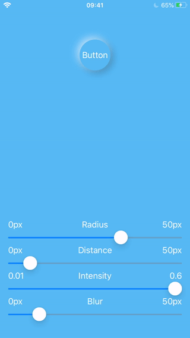

# NeoButton (NOT COMPLETED, BUT MOSTLY READY FOR USE!!!)



Inspired by https://dribbble.com/shots/9986490--UI-Elements?utm_source=Clipboard_Shot&utm_campaign=Kevinduk&utm_content=%F0%9F%92%8E%20UI%20Elements&utm_medium=Social_Share

## Example

To run the example project, clone the repo, and run `pod install` from the Example directory first.

## Requirements

iOS 10 and higher

## Installation

NeoButton is available through [CocoaPods](https://cocoapods.org). To install
it, simply add the following line to your Podfile:

```ruby
pod 'NeoButton'
```

## Author

Igor Kotkovets, igorkotkovets@users.noreply.github.com

## License

NeoButton is available under the MIT license. See the LICENSE file for more info.
